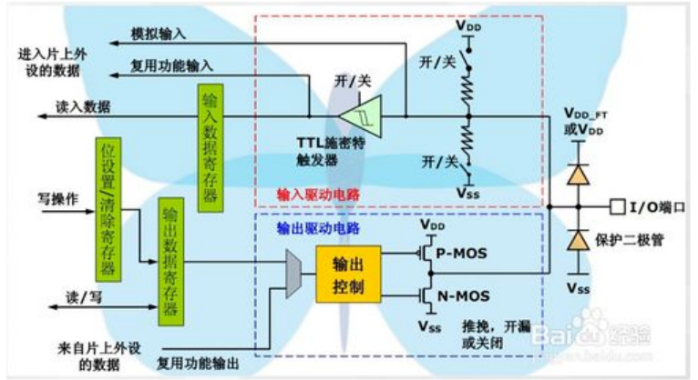
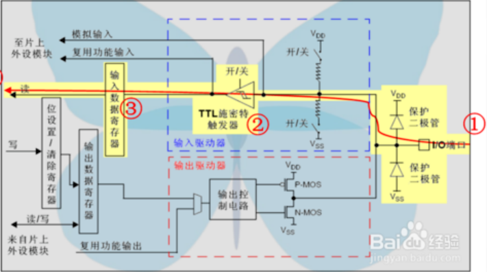
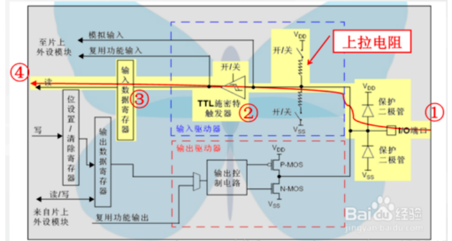
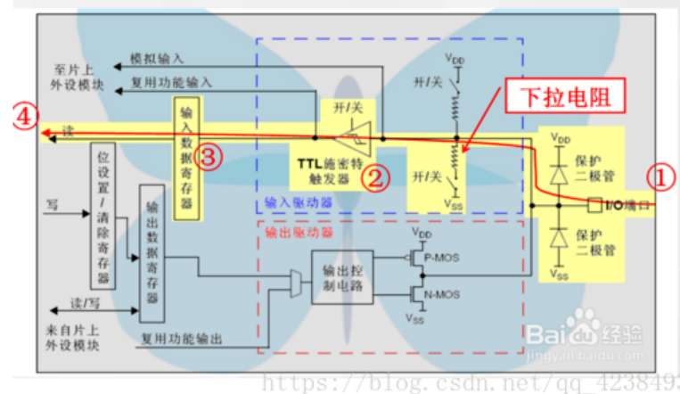
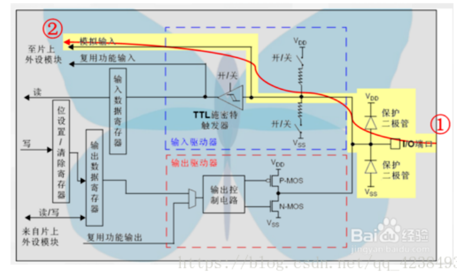
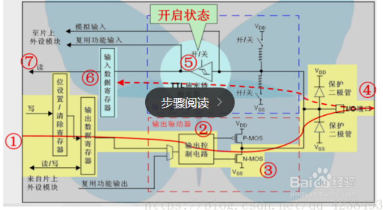
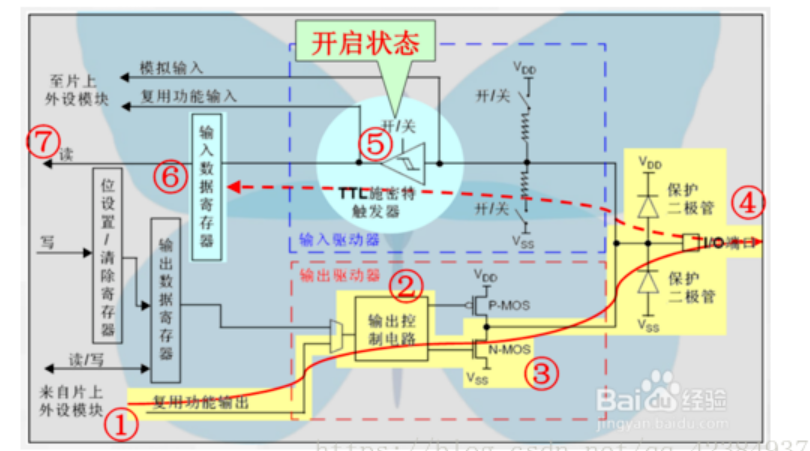
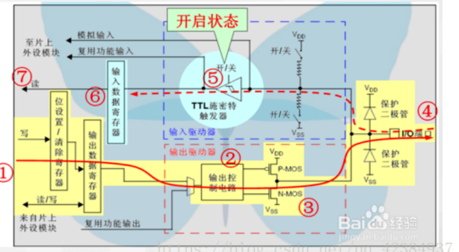
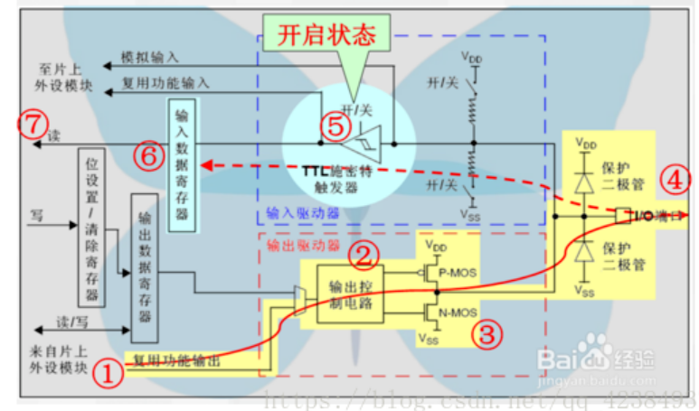

#                              GPIO工作方式



```
（1）GPIO_Mode_AIN 模拟输入
（2）GPIO_Mode_IN_FLOATING 浮空输入
（3）GPIO_Mode_IPD 下拉输入
（4）GPIO_Mode_IPU 上拉输入
（5）GPIO_Mode_Out_OD 开漏输出
（6）GPIO_Mode_Out_PP 推挽输出
（7）GPIO_Mode_AF_OD 复用开漏输出
（8）GPIO_Mode_AF_PP 复用推挽输出
```

## 四种输入模式

注：数据传输通道为黄色部分，依次为1=>2=>3=>4

##### 浮空输入

过程：外部电平信号通过IO端口进入STM32，经过施密特触发器进入输入数据寄存器，在另一端，CPU随时读出IO端口的电平状态。



适用于：KEY识别、RX。

##### 上拉输入

与浮空输入相比，多个一个上拉电阻，阻值范围30k~50k欧姆，CPU在另一端，读电平状态。

上拉就是把电位拉高，比如拉到Vcc



按键

##### 下拉输入

与浮空输入相比，多了一个下拉电阻，阻值范围30k~50k欧姆。

就是把电压拉低，拉到GND。



##### 模拟输入

外部电平信号通过IO端口进入STM32，不经过上下拉电阻，施密特触发器，直接进入ADC模块，输入数据寄存器不反应IO端口的电平状态。

注：模拟输入模式下，CPU不能在“输入数据寄存器”上读到有效的数据。



应用ADC模拟输入，或者低功耗下省电

## 四种输出模式

##### 开漏输出

当CPU在左边的编号1端通过位设置/清除寄存器，或输出数据寄存器写入数据后，该数据位将通过编号2的输出控制电路传送到编号4的I/O端口，如果CPU写入的是逻辑“1”，则编号3的N-MOS管将处于关闭状态，此时I/O端口的电平将由外部的上拉电阻决定，如果CPU写入的是逻辑“0”，则编号3的N-MOS管将处于开启状态，此时I/O端口的电平被编号3的N-MOS管拉到了VSS的零电位。

在图的上半部，施密特触发器处于开启状态，这意味着CPU可以在“输入数据寄存器”的另一端，随时监控I/O端口的状态；通过这个特性，还实现了虚拟的I/O端口双向通信：只要CPU输出逻辑“1”，由于编号3的N-MOS管处于关闭状态，I/O端口的电平将完全由外部电路决定，因此，CPU可以在“输入数据寄存器”读到外部电路的信号，而不是它自己输出的逻辑“1”。



应用：IO输出0接GND，IO输出1，悬空，需要外接上拉电阻，才能实现输出高电平。当输出为1时，IO口的状态由上拉电阻拉高电平，但由于是开漏输出模式，这样IO口也就可以由外部电路改变为低电平或不变。可以读IO输入电平变化，实现C51的IO双向功能

##### 复用开漏输出

与开漏输出模式的配置基本相同，不同的是编号2的输出控制电路的输入，与复用功能的输出端相连，此时输出数据寄存器被从输出通道断开了。同样，CPU可以从“输入数据寄存器”读到外部电路的信号。



片内外设功能（TX1,MOSI,MISO.SCK.SS）

##### 推挽输出

在开漏输出模式的基础上，推挽输出模式仅仅是在编号2的输出控制电路之后，增加了一个P-MOS管。

当输出逻辑“1”时，编号3处的P-MOS管导通，而下方的N-MOS管截止，达到输出高电平的目的。

当输出逻辑“0”时，编号3处的P-MOS管截止，而下方的N-MOS管导通，达到输出低电平的目的。

在这个模式下，CPU仍然可以从“输入数据寄存器”读到外部电路的信号。



IO输出0-接GND， IO输出1 -接VCC，读输入值是未知的

应用：小灯泡

##### 复用推挽输出

输出控制电路的输入，与复用功能的输出端相连，此时输出数据寄存器被从输出通道断开了。

其它部分与前述模式一致，包括对“输入数据寄存器”的读取。



片内外设功能（I2C的SCL,SDA）、TX

链接：[(86条消息) GPIO 口的输入，输出模式及其说明_星空闪耀&的博客-CSDN博客_gpio四种输入输出模式](https://blog.csdn.net/qq_42384937/article/details/82428812)

