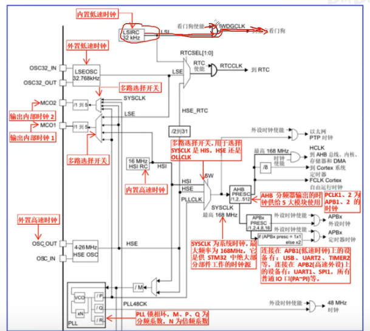
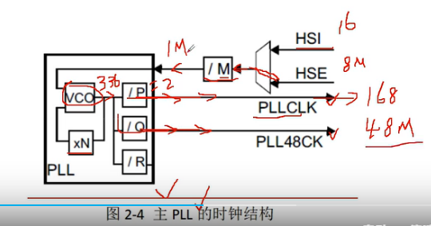
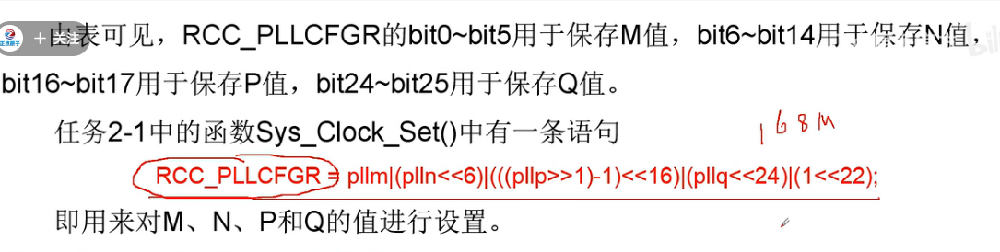
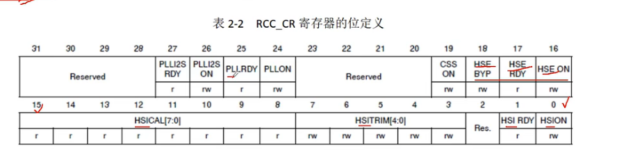
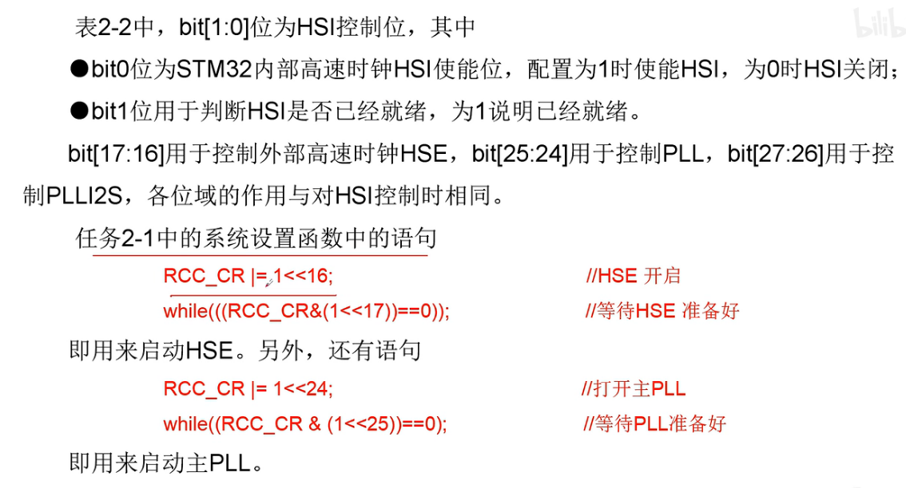

#                        STM32时钟系统

## 一、单片机中时钟系统的作用

单片机时钟系统主要作用提供统一的节拍，以便电路有序工作，并达成控制的目的。

比如和心跳相类似

## 二、STM32时钟源

1、内置低速时钟LSI，频率为32Khz，用来供独立开门狗和自动唤醒单元使用。

2、外置低速时钟LSE，它需要外接频率为32.768kHZ的石英晶体，作为RTC时钟源。

3、高速内部时钟HSI，频率为16Mhz，可以直接作为系统时钟SYSCLK，也可以作为PLL的输入。优点是成本低，启动速度快，缺点：精度差。

4、外置高速时钟HSE，HSE使用晶振作为HSE的时钟源。

eg:使能时钟原因：信号过来会遇到与门，打开时钟，信号才能过去。

## 三、主锁相环PLL和内部结构及其作用

锁相环用于将频率抬高。STM32的时钟系统有两个锁相环，一个是主PLL，一个是专用PLL。

主PLL有两个不同的输出信号，一个经P分频后变为PLLCLK，PLLCLK一般被用做系统时钟SYSCLK的来源。一个经Q分频变为PLL48CK。

##### 主PLL的时钟源输入选择

主PLL的输入信号可以由HSI和HSE提供，到底选择哪个作为主PLL的输入由寄存器PLLCFGR的第22位决定，该bit22作用如下：

​             配置为0：选择HSI时钟作为PLL和PLLI2S时钟输入。

​             配置为1：选择HSE振荡器时钟作为PLL和PLLI2S时钟输入。

注：该位只有在PLL和PLLI2S已禁止时才可写入。

##### M  N   P  Q 等参数选择

xN表示N倍频，/M、/P和/Q分别代表M  P  Q 分频，一般系统都是使用HSE作为时钟源，此时HSE的频率、PLL的输出频率和这些分频系数有以下关系：

## 四、HSE、HSI和主PLL使能

HSE、HSI和PLL等时钟电路都需要使能才能工作，HSE、HSI、PLL的启动控制由寄存器RCC_CR的相关位控制。

