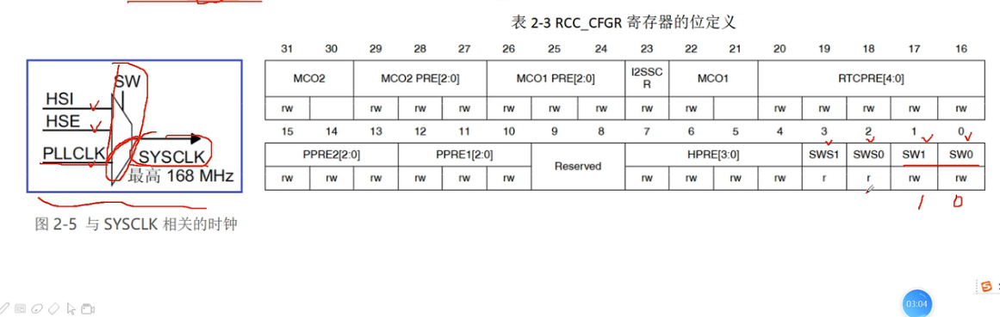
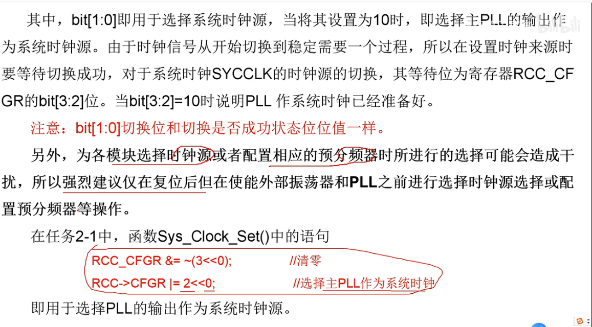
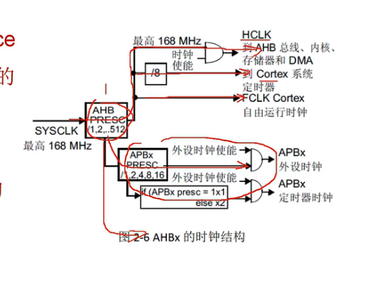
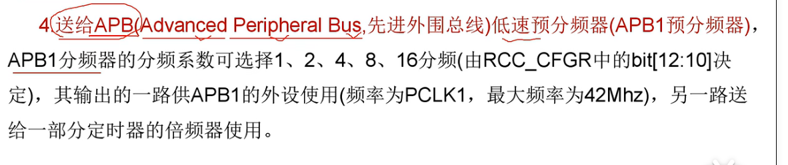
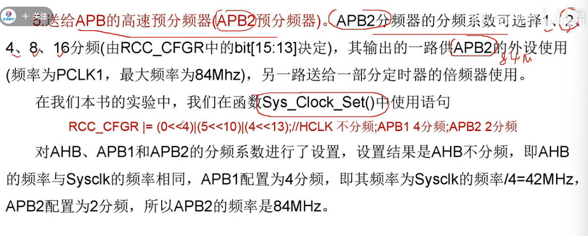
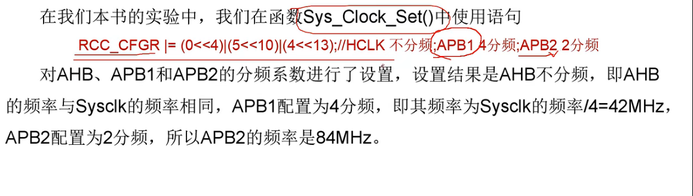
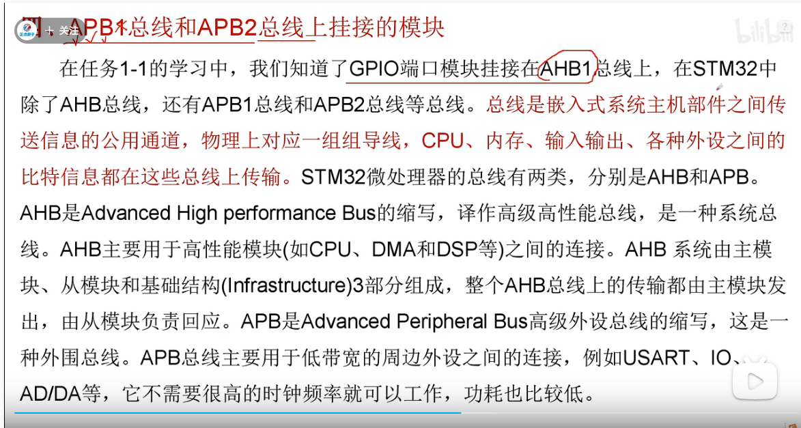

#                          系统时钟   SYSCLK

## 一、系统时钟的作用

系统时钟用于向各模块提供时钟信号来源。

## 二、系统时钟时钟源的选择

系统时钟可由主PLL、HSE或HSI提供，在RCC_CFGR寄存器配置。

## 三、由系统时钟提供时钟源的时钟

 系统时钟经过AHB分频（分频值由RCC_CFGR中的bit[7:4]位决定）后输出的时钟送给以下5个模块使用：

​                 1、AHB总线、内核、内存和DMA使用的HCLK时钟，由于一般情况下AHB不分频，所以HCLK的频率与SYSCLK相同。

​                  2、8分频后给STM32的系统定时器作为它的时钟源，Systick时钟。

​                   3、Cortex的自由运行时钟FCLK。

​                   4、APB的低速预分频器（APB1预分频器）

​                     5、APB的高速预分频器（APB2预分频器）

## 四、APB1总线和APB2总线上挂接的模块

GPIO端口挂接在AHB1总线上，在STM32中除了AHB总线，还有APB1总线和APB2总线等。

总线是嵌入式系统主机部件之间传送信息的公用通道，物理上对应一组组导线，CPU、内存、输入输出、各种外设之间的比特信息都在这些总线上传输。

